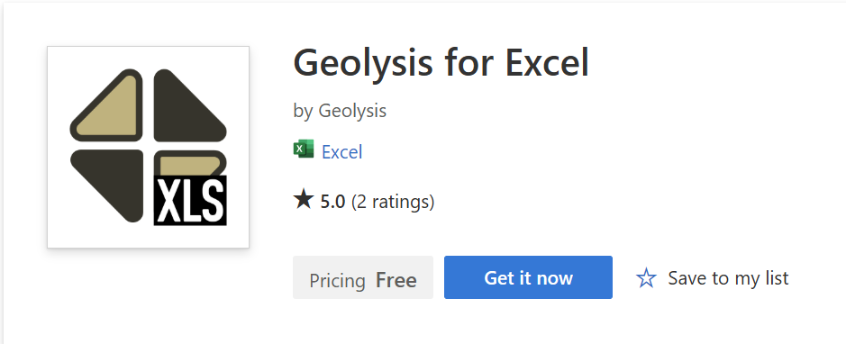
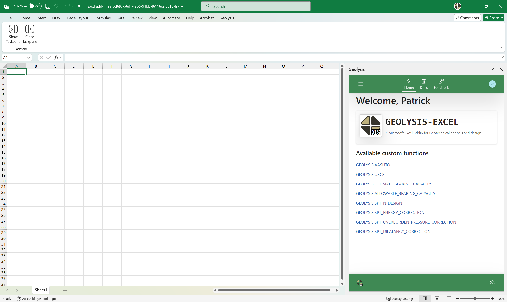

[geolysis_pkg_url]: https://github.com/patrickboateng/geolysis

[linkedin_url]: https://www.linkedin.com/company/geolysis-llc/

<h1 align="center">

</h1>

[][linkedin_url]

Geolysis LLC is building a comprehensive Geotechnical Software Toolkit for the
Geotechnical engineering industry. The toolkit consist of four (4) different
projects namely,
[`geolysis python package`][geolysis_pkg_url],
`geolysis for excel` (or `geolysis for microsoft excel`),
`geolysis for desktop` and `geolysis ai`. Below is a brief description of the
various projects:

> [!IMPORTANT]
> The `geolysis.excel` (an Excel Add-in), is available to install from the
> Microsoft AppSource Store using this installer
> link: [https://appsource.microsoft.com/en-us/product/Office365/WA200009428](https://appsource.microsoft.com/en-us/product/Office365/WA200009428)

1. [**geolysis python package**][geolysis_pkg_url] - _public repository_

   An open-source python package (library) which provides some of the core
   functionalities for _**geolysis for excel**_ and the
   _**geolysis for desktop**_ applications. Click [here][geolysis_pkg_url] for
   more information on the capabilities of the python package.

2. **geolysis for excel** - _private repository_

   An add-in for Microsoft Excel that currently provides custom functions
   for computing _soil classification_,
   _estimating bearing capacity (ultimate and allowable)_, and
   _analyzing spt data_. There are more features underway (for e.g.,
   data entry for laboratory and field tests).

   Below is a screenshot of the Microsoft Excel Interface and a sample video
   demonstrating a use case:

   

   https://github.com/user-attachments/assets/7e272c49-44e9-4aaf-823d-40eca18129ae
   
3. **geolysis for desktop** - _private repository_

   A graphical user interface (GUI) for modeling soils and running soil
   simulations. _More information on this coming soon_

> [!NOTE]
> _geolysis for desktop_ is currently in the design phase.

4. **geolysis ai** - _private repository_

   Offers machine learning models that are trained using geotechnical data.

> [!NOTE]
> A research paper will be released soon.
